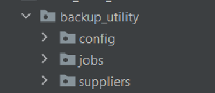

= Homework Concurrency

== Project 'Producer-Queue-Consumer'

== Структура пакетов в проекте

=== Task 1, 2, 3

Поток *Producer* бесконечно считывает целые числа, которые пользователь вводит в *Standard Input*. После ввода сохраняет целые числа в *Queue*. При вводе `-1` поток *Producer* завершает свою работу. Поток *Producer* реализован в пакете `.jobs` классом `CopyJob` с имплементацией интерфейса `Runnable`.

=== Task 4

Если пользователь вводит некорректные данные, то поток *Producer* бросает исключение `UserInputException`, но при этом продолжает работать. `UserInputException` является custom исключением, реализованным в классе `UserInputException` в пакете `.exceptions` расширяя класс `Exceptions`.

=== Task 5, 6, 7

Поток *Consumer*, который забирает числа из *Queue* и засыпает на количество секунд равное этому числу. При этом засыпание потока *Consumer* происходит в том порядке, в котором значения целых чисел были введены пользователем. Поток *Consumer* реализован как класс `ConsumerJob` имплементирующий интерфейса `Runnable` в пакете `.jobs`.

Для реализации и улучшения читаемости когда задачи по записи в *File*: `$+{timestamp}+ - $+{thread-name}+ - I slept $+{seconds}+ seconds` и `$+{timestamp}+ - $+{thread-name}+ - ...` были вынесены в отдельный класс-утилиту `FileUtil` находящийся в пакете `.utils`. Методы из `FileUtil` использованы в `ConsumerJob`.

=== Task 8, 9

Возможность добавления нескольких потоков *Consumer* и конфигурации их количества реализованы в конфигурационном классе `ThreadConfig` в пакете `.config`.

=== Demo

Демонстрация работы находится в тестовом классе `ProducerSupplierDemo` в директории `src/test/java/home_work_1/prodecer_queue_consumer`.
1
== Project 'Backup utility'

== Структура пакетов в проекте

=== Task

Реализация утилиты для резервного копирования директории (т.е ее содержимого). Выполнена по паттерну Producer-Consumer с возможностью конфигурации количества потоков.

Часть *Producer* реализована в пакете `.suppliers` классом `FilesSupplier` с имплементацией интерфейса *Runnable*. Этот класс считывает файлы в директории указанной пользователем и если такая директория существует и не является пустой, выводит в *Standard Output* список файлов.

Часть *Consumer* реализована в пакете `.jobs` классом `CopyJob` с имплементацией интерфейса *Runnable*. Этот класс копирует файлы в резервную директорию указанную пользователем, если директории не существует то, создает необходимую директорию.

Возможность добавления нескольких потоков *Consumer* и конфигурации их количества реализованы в конфигурационном классе `ThreadConfig` в пакете `.config`.

